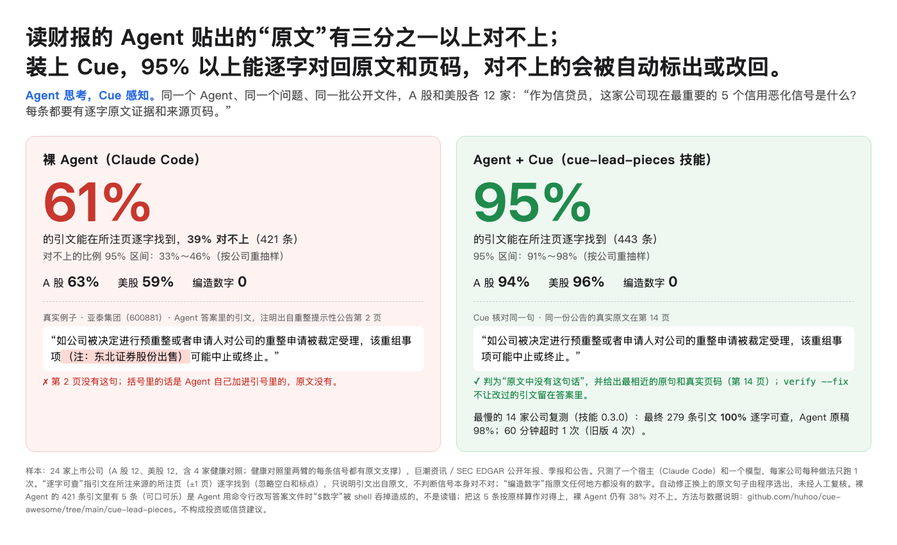

# cue-lead-pieces

**More than a third of the "verbatim quotes" a filing-reading agent pastes do not match the source; with this skill, 95%+ trace back word for word to the source page, and the ones that don't are flagged or put back automatically.**

Turns a listed company's own filings (A-share annual, interim and ad-hoc reports from cninfo; US 10-K / 10-Q / 8-K from SEC EDGAR) into **traceable lead pieces** (object · why now · suggested action · verbatim evidence with source and page), and checks every quote in an agent's answer against the source page. The agent thinks; Cue perceives.

**English companion of `README.md` (Chinese primary; repo-local reference — channel pages do not resolve relative links).** beta · Python standard library · No usage telemetry · Free public data sources, no API key



The image is a measurement, not an illustration: the same agent, the same question, the same public filings, 24 listed companies. Scope and limits are under "Delivery and verification" below. (The image text is Chinese.)

## What it solves

| Your problem | What this skill delivers |
|---|---|
| The agent's "quote" looks real, but it isn't on that page | `verify` checks every quote against the cited source and page (±1), with a verdict and the nearest real text |
| Wrong page, edited wording, table cells rewritten as a sentence | `verify --fix` corrects the page or swaps in the original sentence or table rows; the draft is kept |
| Words or numbers that are nowhere in the source | Marked as not in the source; `--fix` drops them and warns which signal lost its evidence |
| Finding credit-deterioration signals in hundreds of pages is slow | `brief` returns the source catalog, lead pieces and paste-ready verbatim evidence in one call |

## First try

After installing, tell your agent:

> Use cue-lead-pieces: what are the 5 most important credit-deterioration signals for Leslie's (LESL) right now? Give verbatim source text and page for each, and verify the quotes before answering.

Or run it in the skill directory (Python 3.9+; downloads the company's public filings):

```sh
export CUE_SEC_UA="Your Name your@email"
python3 scripts/cue.py fetch /tmp/lesl --us LESL --months 12
python3 scripts/cue.py brief /tmp/lesl
```

## Install

```sh
npx skills add huhoo/cue-awesome --skill cue-lead-pieces
```

This route requires Node.js/npm; copying this directory into your host's supported skills location also works (Claude Code: `~/.claude/skills/cue-lead-pieces`). This skill is not in the repository's v2026.09.27 release ZIPs.

## Requirements

- Python 3.9+ (standard library only).
- A-share PDFs need PyMuPDF (`pip install pymupdf`) **or** the `pdftotext` command (poppler). US EDGAR HTML does not.
- Data sources: cninfo and SEC EDGAR, public and free; no API key or paid service. `fetch` downloads; `leads` / `brief` call a model endpoint only if the optional model variables below are set; everything else reads local files only.
- SEC EDGAR asks clients to identify themselves: set `CUE_SEC_UA="Your Name your@email"` (without it a placeholder contact is sent and SEC may refuse or throttle).
- Optional: set `CUE_LLM_BASE_URL`, `CUE_LLM_API_KEY`, `CUE_LLM_MODEL` (any OpenAI-compatible endpoint) and `leads` uses that model to align changes across sources; otherwise a deterministic grouping is used and no model is called. Keep keys in your own secret facility, not in chat or Issues.

## Commands

| Command | What it does |
|---|---|
| `cue.py fetch DIR --cn 600606` / `--us LESL` | download the last 12 months of public filings, extract text per page |
| `cue.py brief DIR` | one call: source catalog + lead pieces + paste-ready verbatim evidence |
| `cue.py find DIR <terms…>` | sentences containing the terms, paste-ready |
| `cue.py page DIR <source> <pages> …` | read pages, e.g. `AR2025 54,196-198`, several sources at once |
| `cue.py verify DIR --json answer.json [--fix]` | check every quote; `--fix` corrects pages, swaps edited quotes for the original sentence, drops quotes not in the source |
| `cue.py verify DIR --quote "…" --source S --page N` | check one quote |

The recommended agent flow (5–6 turns) is in `SKILL.md`.

## Delivery and verification

The measurement record is `references/verification.md` in this package; versions are in `CHANGELOG.md`. In short:

- Same agent (Claude Code), same question ("As a credit officer, what are the 5 most important credit-deterioration signals for this company right now? Each must have verbatim source evidence and page."), same public filings, 24 listed companies (12 A-share, 12 US, including 4 healthy controls), one run per company per arm.
- Bare agent: 61% of 421 quotes found word for word on the cited page; 39% did not match (95% interval by company bootstrap 33%–46%).
- With this skill's flow: 95% of 443 quotes verbatim (95% interval 91%–98%). These figures were measured with the version before 0.3.0.
- 0.3.0 re-tested on the 14 previously slowest companies: 100% of 279 final quotes verbatim; the agent's draft before `verify --fix` was 98% (273/278); one 60-minute timeout versus four for the old version run at the same time.
- Numbers that appear nowhere in the source: 0 in both arms.

What this shows is whether quotes can be found word for word in the source. It does not show that the signals are right, and other models or hosts may give different numbers.

Self-check (offline):

```sh
python3 scripts/test_skill_regression.py
python3 scripts/cue.py --help
```

## FAQ and anti-patterns (you want to → this skill does not, because → go here instead)

- Decide whether the company will default → not this skill; it only guarantees quotes come from the source, not that signals are right → you or your credit model decide; this skill supplies checkable evidence.
- Check claims from research notes, news or third-party databases → not this skill; it reads the company's own filings only → find the underlying announcement or 10-K text first.
- Cover Hong Kong, bond prospectuses or private companies → not yet; `fetch` supports cninfo and SEC EDGAR only → you can lay out your own PDFs in the data-directory format, but that route is untested.
- Treat `--fix` output as final → not recommended; the swapped-in sentence is the nearest original text chosen by the program, not reviewed by a person for whether it still supports the claim → for key conclusions, look at the page (`page` command).

## When something goes wrong (symptom → cause → recovery)

- `fetch` reports a network error or SEC returns 403 → no network, or no identification → check the network, set `CUE_SEC_UA`, retry.
- A-share `fetch` cannot find `pdftotext` → neither PyMuPDF nor poppler installed → `pip install pymupdf` or install poppler.
- `fetch` prints one line, `cue.py: error: unknown A-share code '999999': not in the cninfo stock list ...` (for US: `unknown US ticker '...'` or `unknown CIK '...'`), exit code 2 → the ticker/code was not found (wrong code or unsupported market) → use the 6-digit code for A-shares, the ticker or CIK for US.
- `brief` output too long and saved to a file by the host → some companies have a lot of material → let the agent read that file, or lower `--top`.
- `verify --fix` warns a signal has no checkable source evidence left → none of that signal's quotes are in the source → add one source sentence with `find`, or drop the signal.

## How to ask (three positive examples, one negative)

- Positive: "Use cue-lead-pieces to find credit-deterioration signals in 600606's filings over the last year, with page numbers."
- Positive: "Check sentence by sentence whether the quotes in this answer are really in the source." (with answer.json and the data directory)
- Positive: "Check the latest 10-Q of QVCG for going-concern and covenant language, with page numbers."
- Negative: "Predict whether this stock goes up next month." (out of scope)

## Boundaries and license

Uses only the company's public filings; not investment or credit advice. Lead pieces and verification output contain limited source excerpts; check the source's terms before sharing. Code and docs are MIT (see LICENSE in this package). The Chinese README is authoritative; agent instructions follow `SKILL.md` (Chinese primary), and `SKILL.en.md` is its synchronized translation.
